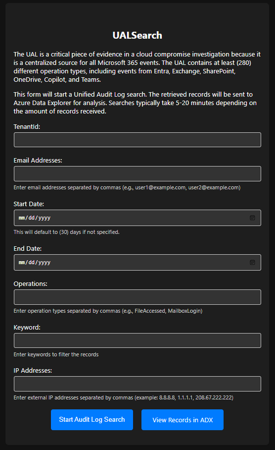

# ADXFlowmaster 0.4.0

This project deploys a community Threat Hunting POC named ADXFlowmaster. This event-driven system ingests Azure Virtual Network Flow Logs, Defender for Endpoint DeviceNetworkEvents Logs, M365 Unified Audit Logs, Entra MicrosoftGraphActivityLogs and Microsoft Sentinel ThreatIntelligenceIndicators for analysis in Azure Data Explorer.

While Log Analytics/Microsoft Sentinel are excellent solutions for daily security & performance monitoring, the 30k record limit & SaaS resource limits are not ideal for bulk threat hunting & foriesic analysis. 

The ADXFlowmaster framework is designed to be extended & customized. All source files are included. SecOps teams can deploy via the Azure 'Deploy' button or hand off to their cloud team to throw into an a Github Action or Azure Pipeline CI/CD Workflow. 

The program:

- Deliver logs to Blob containers - This can be done automatically with Azure Diagnostic Settings or Defender XDR Streaming API
- Ingest those "bulk" and speciality "as needed" logs into Azure Data Explorer
- Use those powerful raw logs to threat hunt and fully investigate incidents
- Control your compute, storage, and record throttles! Scale up during incidents, run "lean and mean" the rest of the time
- Search your bulk logs from Microsoft Sentinel via the KQL ExternalData operator
- Ingest and operationalize bulk logs for 1/5 of the typical Analytic Tier Sentinel ingest cost

ADXFlowmaster Idle Monthly Cost: $480 USD 

## What are VNET Flow logs?

Flow logs are the source of truth for all network activity in Azure Virtual Networks.

Key properties of virtual network flow logs include:

- Flow logs operate at Layer 4 of the Open Systems Interconnection (OSI) model and record all IP flows going through a virtual network.
- Logs are collected at one-minute intervals through the Azure platform. They don't affect your Azure resources or network traffic.
- Logs are written in the JavaScript Object Notation (JSON) format.
- Each log record contains the network interface that the flow applies to, 5-tuple information, traffic direction, flow state, encryption state, and throughput information.
- All traffic flows in your network are evaluated through the applicable network security group rules or Azure Virtual Network Manager security admin rules.

Both virtual network flow logs and network security group flow logs record IP traffic, but they differ in their behavior and capabilities.

Virtual network flow logs simplify the scope of traffic monitoring because you can enable logging at virtual networks. Traffic through all supported workloads within a virtual network is recorded.

Virtual network flow logs also avoid the need to enable multiple-level flow logging, such as in network security group flow logs. In network security group flow logs, network security groups are configured at both the subnet and the network interface (NIC).

In addition to existing support to identify traffic that network security group rules allow or deny, Virtual network flow logs support identification of traffic that Azure Virtual Network Manager security admin rules allow or deny. Virtual network flow logs also support evaluating the encryption status of your network traffic in scenarios where you're using virtual network encryption

## What are Defender for Endpoint DeviceNetworkEvents streaming logs?

The DeviceNetworkEvents table in the advanced hunting schema contains information about network connections and related events. For MDE-enrolled Servers & Workstations, it is important communication data that includes a subset of Zeek events. By combining this data with VNET Flow Logs from Azure Virtual Networks, you have (1) place to Threat Hunt malicious traffic regardless of the traditional networking vendors in use. 

## What are Graph API MicrosoftGraphActivityLogs?

Microsoft Graph activity logs are an audit trail of all HTTP requests that the Microsoft Graph API received and processed for a tenant.
These logs are key for hunting modern identity (BEC) & cloud-compremise behaviors and tools. (such as GraphHunter)

Users in tenant	Storage GiB/month
1000	            14
100000	         1000

Because of the cost associated with ingest into a Sentinel-enabled Log Analytics workspace, this key log source is often "not collected".

[More Information about Graph Threat Hunting](https://techcommunity.microsoft.com/t5/microsoft-security-experts-blog/hunting-with-microsoft-graph-activity-logs/ba-p/4234632#:~:text=Microsoft%20Graph%20activity%20logs%20provides%20a%20history%20of,and%20show%20how%20it%20can%20be%20used%20effectively.)

## What are UnifiedAuditLogs?

The UAL is a critical piece of evidence in a cloud compremise investigations because it is a centralized source for all Microsoft 365 events. The UAL contains at least (280) different operation types, including events from Entra, Exchange, SharePoint, OneDrive, Copilot and Teams. 

The Add-Ons:

UALSearch- On-demand search tool that uses PowerShell 7 Parallel to rapidly ingest UAL logs into Azure Data Explorer. Offers Date range, Operations, UserId, and IP filters. (Terrible front-end example included in the Parts folder but you can do better)

UALMaster- This customizable Azure Function uses a highly adaptive & fault-tolerant method to continuiously export UAL Logs (selected Operation types) from M365 tenants. 

## Overview

This project deploys the following Azure resource types:

- Application Insights
- Azure Data Explorer
- Azure Event Grid
- Azure Event Hub
- Azure Monitor Private Link Scope
- Azure Function
- Azure Storage
- Log Analytics Workspace (internal)
- User Managed Identity

## Deployment

1. Hit the blue "Deploy" button below.

2. Specify your settings. 

   ## Example:

   

## Configure Log Ingest:

🔻 [Configure](https://www.azadvertizer.net/azpolicyadvertizer/3e9965dc-cc13-47ca-8259-a4252fd0cf7b.html) VNET Flow Logs via Azure Policy to (1) Virtual Network or all of them! (Network Traffic Analytics is not required)

🔻 [Configure](https://learn.microsoft.com/en-us/azure/azure-monitor/logs/logs-data-export?tabs=portal#create-or-update-a-data-export-rule) the Log Analytics Data Export Rule to ADXFlowmaster's Storage Account for the ThreatIntelligenceIndicator Table in the Sentinel-enabled Log Analytics Workspace. 

🔻 [Configure](https://learn.microsoft.com/en-us/defender-endpoint/api/raw-data-export-storage) Microsoft Defender for Endpoint to stream DeviceNetworkEvents to ADXFlowmaster's Storage Account.

🔻 [Configure](https://learn.microsoft.com/en-us/graph/microsoft-graph-activity-logs-overview) Entra ID Diagnostic Settings to forward MicrosoftGraphActivityLogs to the ADXFlowmaster storage account. 

🔻 [Optional](https://learn.microsoft.com/en-us/purview/audit-log-investigate-accounts) Enable UALMaster Function App via App Settings to continiously ingest UnifiedAuditLog MailItemsAccessed events for all users. (adjustable)

🔻 Go Hunt! Start by searching "ADXFlowmasterleads" in ADX.

## Acknowledgements:

 This community tool was made possible by the BlueVoyant Digital Forensics & Incident Response team. Need some help with a dumpster fire? Hit us up at incident@bluevoyant.com

## Deployment Guides:

- VS Code: https://learn.microsoft.com/en-us/azure/azure-resource-manager/bicep/deploy-vscode
- Azure CLI: https://learn.microsoft.com/en-us/azure/azure-resource-manager/bicep/deploy-cli
- Azure PowerShell: https://learn.microsoft.com/en-us/azure/azure-resource-manager/bicep/deploy-powershell
- Azure Cloud Shell: https://learn.microsoft.com/en-us/azure/azure-resource-manager/bicep/deploy-cloud-shell
- GitHub Actions: https://learn.microsoft.com/en-us/azure/azure-resource-manager/bicep/deploy-github-actions

Deployment note: A Service Principal with Cloud Application Administrator is required for initial deployment and provisioning of the Entra ID UMI permissions. Post deployment, all authentication is handled by the deployment User-Managed Identity. 

## Contributing

We welcome contributions from the community! If you have any ideas, suggestions, or find any issues, please feel free to open an issue or submit a pull request. Your contributions help make ADXFlowmaster better for everyone.

To report an issue, navigate to the [Issues](https://github.com/msdirtbag/ADXFlowmaster/issues) section and create a new issue with detailed information about the problem. For contributions, fork the repository, create a new branch for your feature or bug fix, and submit a pull request with a clear description of your changes.
