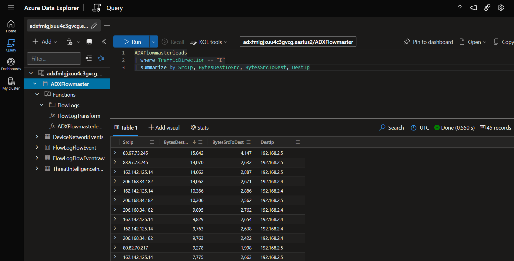

# ADXFlowmaster 0.2.4 Alpha

This project deploys a Threat Hunting solution named ADXFlowmaster. This event-driven system ingests Azure VNET Flow Logs, Defender for Endpoint DeviceNetworkEvents Logs, and Microsoft Sentinel ThreatIntelligenceIndicators for analysis in Azure Data Explorer.

## What are VNET Flow logs?

Flow logs are the source of truth for all network activity in Azure Virtual Networks.

Key properties of virtual network flow logs include:

- Flow logs operate at Layer 4 of the Open Systems Interconnection (OSI) model and record all IP flows going through a virtual network.
- Logs are collected at one-minute intervals through the Azure platform. They don't affect your Azure resources or network traffic.
- Logs are written in the JavaScript Object Notation (JSON) format.
- Each log record contains the network interface that the flow applies to, 5-tuple information, traffic direction, flow state, encryption state, and throughput information.
- All traffic flows in your network are evaluated through the applicable network security group rules or Azure Virtual Network Manager security admin rules.

Both virtual network flow logs and network security group flow logs record IP traffic, but they differ in their behavior and capabilities.

Virtual network flow logs simplify the scope of traffic monitoring because you can enable logging at virtual networks. Traffic through all supported workloads within a virtual network is recorded.

Virtual network flow logs also avoid the need to enable multiple-level flow logging, such as in network security group flow logs. In network security group flow logs, network security groups are configured at both the subnet and the network interface (NIC).

In addition to existing support to identify traffic that network security group rules allow or deny, Virtual network flow logs support identification of traffic that Azure Virtual Network Manager security admin rules allow or deny. Virtual network flow logs also support evaluating the encryption status of your network traffic in scenarios where you're using virtual network encryption

## What are Defender for Endpoint DeviceNetworkEvents streaming logs?

The DeviceNetworkEvents table in the advanced hunting schema contains information about network connections and related events. For MDE-enrolled Servers & Workstations, it is important communication data that includse a subset of Zeek events. By combining this data with VNET Flow Logs from Azure Virtual Networks, you have (1) place to Threat Hunt malicious traffic regardless of the traditional networking vendors in use. 

## Overview

This project deploys the following Azure resource types:

- Azure Data Explorer
- Azure Event Grid
- Azure Event Hub
- Azure Storage
- Log Analytics Workspace (internal)
- User Managed Identity

## Deployment

1. Hit the blue "Deploy" button below.

2. Specify your settings. 

   ## Example:

   

## Configure Log Ingest:

🔻 [Configure](https://www.azadvertizer.net/azpolicyadvertizer/3e9965dc-cc13-47ca-8259-a4252fd0cf7b.html) VNET Flow Logs via Azure Policy to (1) Virtual Network or all of them! (Network Traffic Analytics is not required)

🔻 [Configure](https://learn.microsoft.com/en-us/azure/azure-monitor/logs/logs-data-export?tabs=portal#create-or-update-a-data-export-rule) the Log Analytics Data Export Rule to ADXFlowmaster's Storage Account for the ThreatIntelligenceIndicator Table in the Sentinel-enabled Log Analytics Workspace. 

🔻 [Configure](https://learn.microsoft.com/en-us/defender-endpoint/api/raw-data-export-storage) Microsoft Defender for Endpoint to stream DeviceNetworkEvents to ADXFlowmaster's Storage Account.

🔻 Go Hunt! Start by searching "ADXFlowmasterleads" in ADX.

## Deployment Guides:

- VS Code: https://learn.microsoft.com/en-us/azure/azure-resource-manager/bicep/deploy-vscode
- Azure CLI: https://learn.microsoft.com/en-us/azure/azure-resource-manager/bicep/deploy-cli
- Azure PowerShell: https://learn.microsoft.com/en-us/azure/azure-resource-manager/bicep/deploy-powershell
- Azure Cloud Shell: https://learn.microsoft.com/en-us/azure/azure-resource-manager/bicep/deploy-cloud-shell
- GitHub Actions: https://learn.microsoft.com/en-us/azure/azure-resource-manager/bicep/deploy-github-actions
